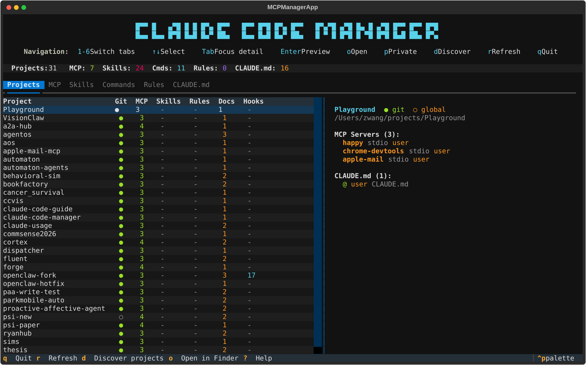
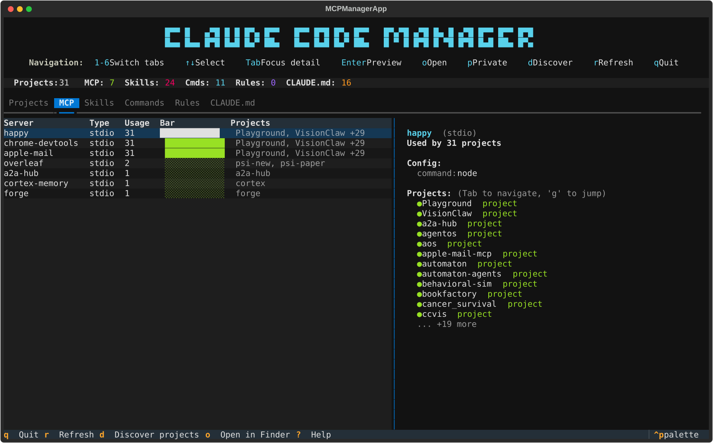
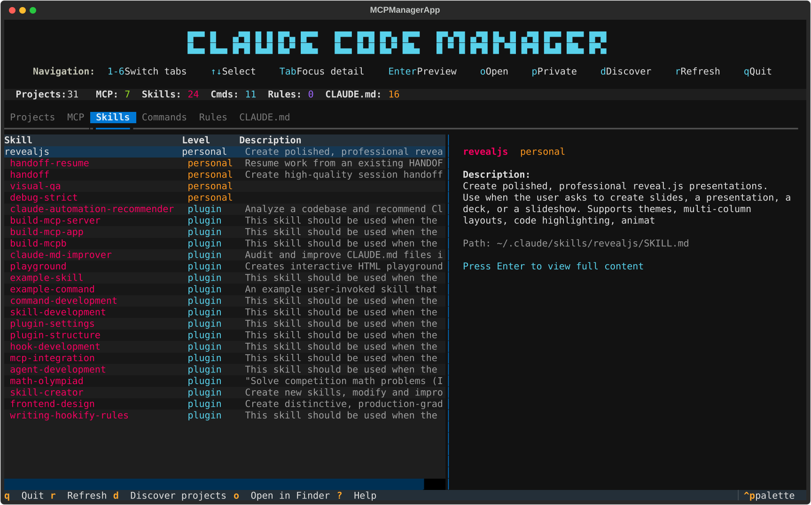

# Claude Code Manager

> **One dashboard for all your Claude Code configurations** — MCP servers, skills, commands, rules, and CLAUDE.md files across every project on your machine.

[](https://pypi.org/project/ccmanager/)
[](https://pypi.org/project/ccmanager/)
[](https://www.python.org/)
[](LICENSE)
[](https://textual.textualize.io/)

<p align="center">
  
</p>

## Why?

If you use [Claude Code](https://docs.anthropic.com/en/docs/claude-code) across multiple projects, your configuration sprawls fast — MCP servers in `.mcp.json`, skills in `.claude/skills/`, commands scattered across projects, CLAUDE.md files nested in subdirectories. **Claude Code Manager** gives you a single view of everything, ranked by usage, with instant navigation.

## Quick Start

```bash
# Install (pick one)
pip install ccmanager          # pip
uv tool install ccmanager      # uv (recommended — isolated, no conflicts)

# Run
ccmanager ~/Projects
```

<details>
<summary><code>command not found</code>? Expand for fix.</summary>

On macOS, pip installs to `~/Library/Python/3.x/bin/` which may not be in PATH:

```bash
echo 'export PATH="$HOME/Library/Python/3.9/bin:$PATH"' >> ~/.zshrc && source ~/.zshrc
```

Or use `uv tool install` — it handles PATH automatically.
</details>

## Features

### Projects Overview

See every Claude Code project at a glance — git status, MCP server count, skills, commands, rules, and CLAUDE.md files. Select any project to see its full configuration in the detail panel.

<p align="center">
  
</p>

### MCP Server Analytics

All MCP servers across every project, ranked by usage. See which servers are most popular, their transport type, and which projects use them. Jump directly to a server's projects with `g`.

<p align="center">
  
</p>

### Skills, Commands, and More

Browse user-level and project-level skills, slash commands, rules, and CLAUDE.md files. Press Enter to preview full content inline.

<p align="center">
  
</p>

### Full Feature List

- **Multi-Project Scanning** — Point at a directory and discover all Claude Code projects
- **6 Configuration Tabs** — Projects, MCP Servers, Skills, Commands, Rules, CLAUDE.md
- **Content Preview** — Press Enter to view full content of any item
- **Cross-Navigation** — Jump between projects and their MCP servers with `g` / `s`
- **System Discovery** — Find Claude Code projects scattered anywhere on your machine
- **Usage Analytics** — MCP servers ranked by adoption across projects
- **Privacy Mode** — Toggle `p` to redact project names for screenshots

## Keyboard Shortcuts

| Key | Action |
|-----|--------|
| `1`-`6` | Switch tabs (Projects, MCP, Skills, Commands, Rules, CLAUDE.md) |
| `Up` / `Down` | Navigate list |
| `Tab` | Focus detail panel |
| `Enter` | Preview full content |
| `g` | Jump to project's MCP servers |
| `s` | Show which projects use a server |
| `o` | Open in Finder (macOS) |
| `d` | Discover projects across system |
| `p` | Toggle privacy mode |
| `r` | Refresh scan |
| `?` | Help |
| `q` | Quit |

## What It Scans

Claude Code Manager understands the full configuration precedence:

| Level | Location | Priority |
|-------|----------|----------|
| Enterprise | `/Library/Application Support/ClaudeCode/` | Highest |
| Local | `~/.claude.json` → `projects[path]` | 2nd |
| Project | `.mcp.json` | 3rd |
| User | `~/.claude.json` → `mcpServers` | Lowest |

It also scans:
- **Skills**: `~/.claude/skills/*/SKILL.md` and `.claude/skills/*/SKILL.md`
- **Commands**: `~/.claude/commands/*.md` and `.claude/commands/*.md`
- **Rules**: `~/.claude/rules/**/*.md` and `.claude/rules/**/*.md`
- **CLAUDE.md**: Root, `.claude/`, subdirectories, and local variants

## Contributing

```bash
git clone https://github.com/simonstrumse/claude-code-manager.git
cd claude-code-manager
python3 -m venv venv && source venv/activate
pip install -e .
ccmanager ~/Projects   # verify it works
```

PRs welcome. Please test that the TUI launches without errors and update CHANGELOG.md for significant changes.

## Troubleshooting

<details>
<summary><strong>No projects found</strong></summary>

Point at a directory containing Claude Code projects (need `.git`, `.mcp.json`, or `.claude/` to be detected):

```bash
ccmanager ~/Projects      # scan a folder of projects
ccmanager .               # scan current directory
```
</details>

<details>
<summary><strong>Not finding MCP servers or skills</strong></summary>

Run with `--debug` to see what paths are being checked:

```bash
ccmanager --debug ~/Projects
```

Common issues:
- Wrong key name (`mcp_servers` vs `mcpServers` — must be camelCase)
- Skills missing `SKILL.md` file inside the folder
</details>

<details>
<summary><strong>TUI looks broken</strong></summary>

- Ensure terminal supports Unicode and is at least 100 columns wide
- Try iTerm2, Alacritty, or Windows Terminal
</details>

## License

MIT — see [LICENSE](LICENSE).

## Acknowledgments

Built with [Textual](https://textual.textualize.io/). Inspired by the need to make sense of Claude Code's configuration system across dozens of projects.
