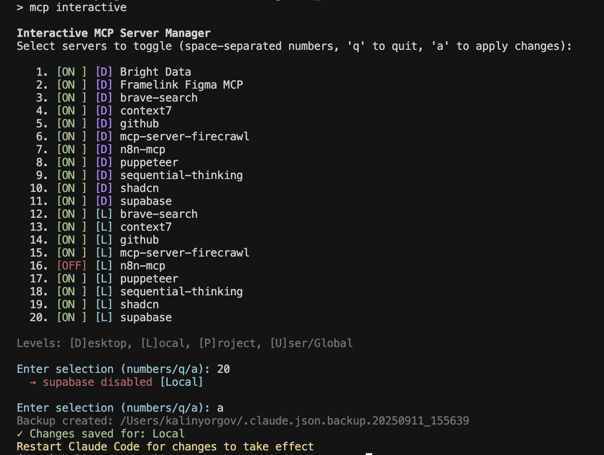

# Claude Code Manager

> **See all your MCP servers, skills, commands, rules, and CLAUDE.md files in one place** — across every project on your machine

[](https://www.python.org/)
[](LICENSE)
[](https://claude.ai/code)
[](https://textual.textualize.io/)

[Quick Start](#quick-start) | [Features](#features) | [Usage](#usage) | [Configuration](#what-it-scans) | [Contributing](#contributing)

---



## Quick Start

```bash
# Install from source
git clone https://github.com/simonstrumse/claude-code-manager.git
cd claude-code-manager
pip install -e .

# Run it
ccmanager ~/Projects
```

That's it! The TUI will scan your projects folder and display all Claude Code configurations.

---

## Features

- **Multi-Project Scanning** — Scan an entire folder of projects and see all configurations at a glance
- **6 Configuration Tabs** — Projects, MCP Servers, Skills, Commands, Rules, CLAUDE.md
- **Content Preview** — Press Enter to view full content of any skill, command, rule, or CLAUDE.md
- **Cross-Navigation** — Jump between projects and their MCP servers with `g` and `s` keys
- **Project Discovery** — Find Claude Code projects scattered across your system
- **Usage Analytics** — See which MCP servers are used most across your projects
- **Privacy Mode** — Toggle `p` to redact project names for screenshots

---

## Usage

### Launch the TUI

```bash
ccmanager ~/Projects      # Scan a projects folder
ccmanager                 # Scan current directory
```

### Keyboard Navigation

| Key | Action |
|-----|--------|
| `1-6` | Switch tabs (1=Projects, 2=MCP, 3=Skills, 4=Commands, 5=Rules, 6=CLAUDE.md) |
| `↑↓` | Navigate list items |
| `Tab` | Move focus: list → detail panel |
| `Enter` | Preview full content |
| `g` | Go to project's MCP servers |
| `s` | Show server's projects |
| `o` | Open in Finder (macOS) |
| `d` | Discover projects across system |
| `p` | Toggle privacy mode |
| `r` | Refresh scan |
| `?` | Show help |
| `q` | Quit |

### Tabs Overview

| Tab | What it shows |
|-----|---------------|
| **Projects** | All scanned projects with config counts |
| **MCP** | All MCP servers ranked by usage |
| **Skills** | User and project skills |
| **Commands** | Slash commands (/commit, etc.) |
| **Rules** | Always-on instruction files |
| **CLAUDE.md** | Project documentation files |

---

## What It Scans

The tool understands Claude Code's configuration precedence:

| Level | Location | Priority |
|-------|----------|----------|
| Enterprise | `/Library/Application Support/ClaudeCode/` | Highest |
| Local | `~/.claude.json` → `projects[path]` | 2nd |
| Project | `.mcp.json` | 3rd |
| User | `~/.claude.json` → `mcpServers` | Lowest |

### Scanned Locations

- **MCP Servers**: Enterprise, User, Project, Local levels
- **Skills**: `~/.claude/skills/*/SKILL.md` and `.claude/skills/*/SKILL.md`
- **Commands**: `~/.claude/commands/*.md` and `.claude/commands/*.md`
- **Rules**: `~/.claude/rules/**/*.md` and `.claude/rules/**/*.md`
- **CLAUDE.md**: Root, `.claude/`, subdirectories, local variants

---

## Project Structure

```
claude-code-manager/
├── mcp_tui.py          # Main TUI application (Textual)
├── mcp_scanner.py      # Configuration scanning logic
├── mcp_data.py         # Data models and classes
├── mcp_config.py       # User settings management
├── mcp_operations.py   # Project move/consolidate operations
├── requirements.txt    # Python dependencies
└── CHANGELOG.md        # Development history
```

---

## Contributing

Contributions welcome! This is a learning project, so please be patient and constructive.

### Development Setup

```bash
git clone https://github.com/YOUR_USERNAME/claude-code-manager.git
cd claude-code-manager
python3 -m venv venv && source venv/activate
pip install -e .
```

### Guidelines

1. **Test your changes** — Make sure the TUI runs without crashing
2. **Follow existing patterns** — Look at how similar features are implemented
3. **Document changes** — Update CHANGELOG.md for significant changes
4. **Keep it simple** — Prefer readable code over clever code

---

## Troubleshooting

<details>
<summary><strong>"No projects found"</strong></summary>

- Make sure you're pointing to a directory that contains Claude Code projects
- Projects need `.git`, `.mcp.json`, or `.claude/` folder to be detected
</details>

<details>
<summary><strong>TUI looks broken</strong></summary>

- Make sure your terminal supports Unicode
- Try a different terminal (iTerm2, Alacritty, Windows Terminal)
- Ensure terminal is at least 100 columns wide
</details>

<details>
<summary><strong>Preview not opening</strong></summary>

- Tab to focus the detail panel first
- Then press Enter
- Press Escape or 'q' to close the preview
</details>

---

## License

MIT License — see [LICENSE](LICENSE) file.

## Acknowledgments

- Built with [Textual](https://textual.textualize.io/) — the amazing Python TUI framework
- Inspired by the need to understand Claude Code's configuration system
- Thanks to Anthropic for creating Claude Code

---

**Safe Computing Reminder**: Always review code from the internet before running it. This tool only reads your configuration files — it doesn't modify anything without your explicit action.
