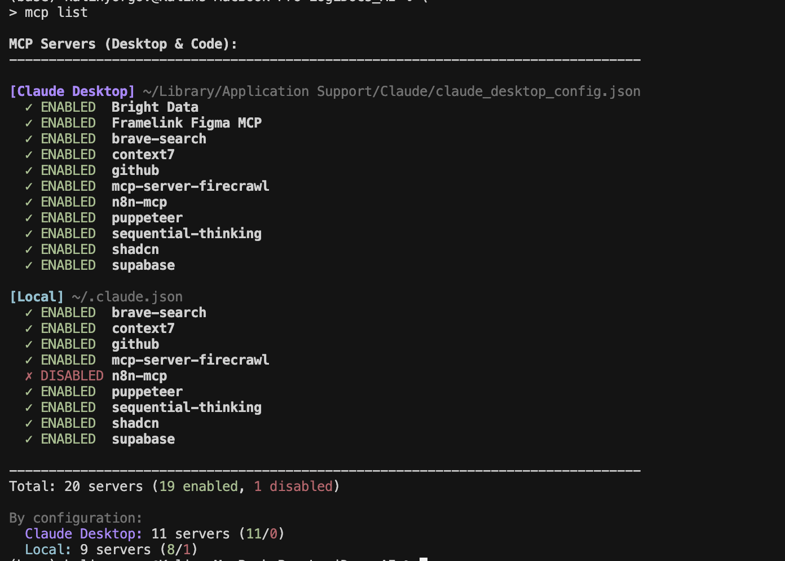
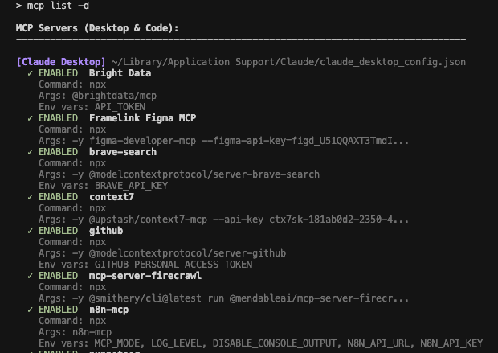

# MCP Server Manager for Claude 🎛️

A powerful CLI tool to manage MCP (Model Context Protocol) servers across **Claude Desktop** and **Claude Code**. Enable, disable, and manage your MCP servers without losing configuration!


## 🌟 Features

- **🔍 Auto-detects** Claude Desktop and Claude Code installations
- **🎯 Manages servers across all configuration levels** (Desktop, User, Project, Local)
- **🎨 Color-coded display** - Different colors for different configuration sources
- **💾 Preserves configurations** when disabling servers
- **🔄 Interactive mode** for easy management
- **📁 Works in any project directory** after global installation
- **🔐 Automatic backups** before making changes

## 📸 Screenshots

### List View

*Shows all MCP servers with their status and configuration source*

### Interactive Mode

*Toggle multiple servers easily with interactive selection*

### Detailed View

*Detailed configuration information for each server*

## 🚀 Quick Start

### 1. Clone the Repository
```bash
git clone https://github.com/yourusername/mcp-server-manager.git
cd mcp-server-manager
```

### 2. Install Globally (Recommended)
```bash
# Automatic installation
chmod +x install.sh
./install.sh

# OR Manual installation
sudo cp mcp_manager.py /usr/local/bin/mcp-manager
sudo chmod +x /usr/local/bin/mcp-manager
sudo ln -s /usr/local/bin/mcp-manager /usr/local/bin/mcp
```

### 3. Use from Any Project!
```bash
cd /any/project/directory
mcp list  # See all MCP servers for this context
```

## 🎮 Usage

### Basic Commands

```bash
# List all MCP servers
mcp list

# Detailed view with configuration info
mcp list -d

# Interactive mode (easiest way to manage servers)
mcp interactive

# Toggle a specific server
mcp toggle github

# Get help
mcp --help
```

### Managing Servers by Application

```bash
# Manage only Claude Desktop servers
mcp --app desktop list
mcp --app desktop interactive

# Manage only Claude Code servers
mcp --app code list
mcp --app code interactive

# Auto-detect (default)
mcp list
```

## 🎯 Interactive Mode

The interactive mode is the easiest way to manage your servers:

```bash
mcp interactive
```

You'll see:
```
Interactive MCP Server Manager
Select servers to toggle (space-separated numbers, 'q' to quit, 'a' to apply changes):

  1. [ON ] [D] brave-search
  2. [ON ] [D] github
  3. [OFF] [D] puppeteer
  4. [ON ] [L] sequential-thinking
  5. [ON ] [P] project-specific-server

Levels: [D]esktop, [L]ocal, [P]roject, [U]ser/Global

Enter selection (numbers/q/a): 1 3 4
```

- **Enter numbers** separated by spaces to toggle servers
- **Press `a`** to apply and save changes
- **Press `q`** to quit

## 📊 Understanding Configuration Levels

MCP servers can be configured at different levels, with different priorities:

### Claude Desktop
- **Location**: `~/Library/Application Support/Claude/claude_desktop_config.json` (macOS)
- **Indicator**: `[D]` in purple
- **Scope**: Available in Claude Desktop app

### Claude Code Levels (Priority Order)
1. **Local** `[L]` - Project-specific in `~/.claude.json`
2. **Project** `[P]` - `.mcp.json` or `.claude/settings.json` in project
3. **User/Global** `[U]` - `~/.claude.json` global section

Higher priority levels override lower ones.

## 🔍 Finding MCP Server Sources

Use the included detector to find WHERE servers come from:

```bash
cd /your/project
python3 ~/path/to/mcp-server-manager/claude_mcp_detector.py
```

This shows:
- All configuration files
- Which servers are in each file
- Which servers are actually ACTIVE
- The priority order

## 💡 Common Use Cases

### Disable Unused Servers in a Project
```bash
cd ~/Projects/MyProject
mcp interactive
# Select servers to disable
# Press 'a' to apply
```

### Check What Claude Code Sees
```bash
# In your project directory
claude mcp list  # What Claude Code actually uses
mcp list         # What our tool detects
```

### Clean Up Duplicate Servers
If you have the same server in both Desktop and Code:
```bash
mcp interactive
# Disable the duplicate you don't need
```

### Project-Specific Configuration
```bash
cd ~/Projects/MyProject
# Add a project-specific server
claude mcp add github --scope local
# Now manage it with
mcp interactive
```

## 🛠️ Advanced Features

### Backup Management
Every change creates a timestamped backup:
```bash
~/.claude.json.backup.20250110_143022
```

### Disabled Server Storage
Disabled servers are stored in `_disabled_mcpServers` sections, preserving their configuration:
```json
{
  "mcpServers": {
    "active-server": { ... }
  },
  "_disabled_mcpServers": {
    "disabled-server": { ... }
  }
}
```

### Direct Config Editing
The tool modifies your config files directly, so you can also:
1. Use `mcp list` to see current state
2. Edit the JSON files manually if needed
3. Use `mcp list` to verify changes

## 🐛 Troubleshooting

### "No MCP servers found"
- Check if Claude Desktop or Claude Code is installed
- Run `mcp list -d` to see which config files are being checked
- Ensure config files exist and are valid JSON

### Changes not taking effect
- **Claude Desktop**: Restart the app
- **Claude Code**: Restart with `claude` command in your project

### Permission denied
```bash
# Use sudo for system directories
sudo cp mcp_manager.py /usr/local/bin/mcp-manager

# Or install in user directory
mkdir -p ~/.local/bin
cp mcp_manager.py ~/.local/bin/mcp-manager
export PATH="$PATH:~/.local/bin"
```

### Different servers in Claude Code vs tool
- Claude Code merges configurations from multiple sources
- Use `claude_mcp_detector.py` to see all sources
- Higher priority configs override lower ones

## 📁 Configuration File Locations

### Claude Desktop
- **macOS**: `~/Library/Application Support/Claude/claude_desktop_config.json`
- **Windows**: `%APPDATA%\Claude\claude_desktop_config.json`
- **Linux**: `~/.config/Claude/claude_desktop_config.json`

### Claude Code
- **User/Global**: `~/.claude.json`
- **User Settings**: `~/.claude/settings.json`
- **Project**: `.mcp.json` or `.claude/settings.json`
- **Project Local**: `.claude/settings.local.json`

## 🤝 Contributing

Contributions are welcome! Please feel free to submit a Pull Request.

1. Fork the repository
2. Create your feature branch (`git checkout -b feature/AmazingFeature`)
3. Commit your changes (`git commit -m 'Add some AmazingFeature'`)
4. Push to the branch (`git push origin feature/AmazingFeature`)
5. Open a Pull Request

## 📜 License

This project is licensed under the MIT License - see the [LICENSE](LICENSE) file for details.

## 🙏 Acknowledgments

- Built for the Claude Desktop and Claude Code community
- Inspired by the need for better MCP server management
- Thanks to Anthropic for Claude and the MCP protocol

## 🆕 What's New

### v2.0.0 (Latest)
- ✨ Added Claude Desktop support
- ✨ Auto-detection of Claude Desktop vs Claude Code
- ✨ Multi-level configuration support
- ✨ Global installation script
- ✨ MCP detector tool to find server sources
- 🐛 Fixed macOS compatibility issues

### v1.0.0
- Initial release with Claude Code support

## 📝 Future Features

- [ ] Server groups/profiles
- [ ] Import/export configurations
- [ ] Server health checks
- [ ] GUI version
- [ ] Sync between Desktop and Code
- [ ] Server templates

---

**Made with ❤️ for Claude users everywhere**

If you find this tool helpful, please ⭐ star the repository!